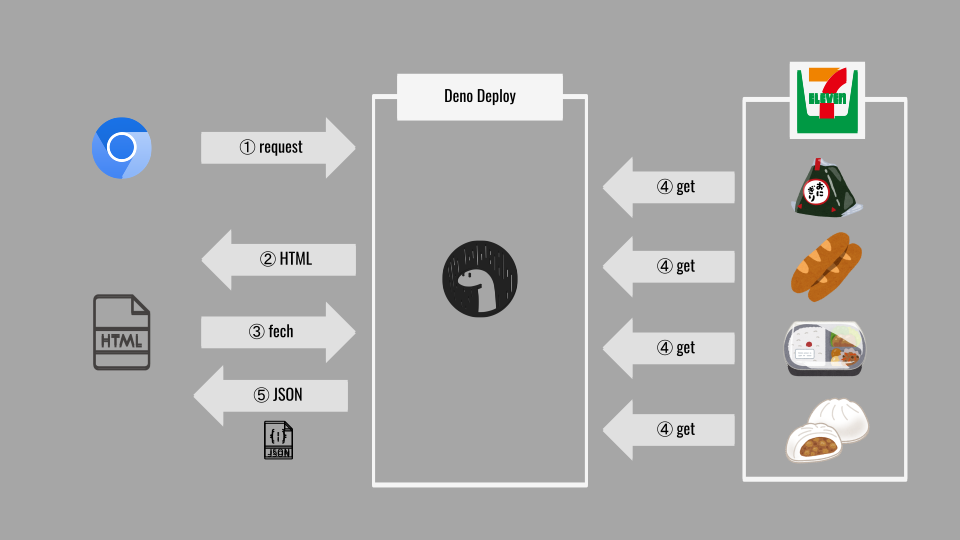

並列でスクレイピングしてみた

---

::: block
自己紹介 {style=background:#3e62ad;width:1000px}
:::

--

|         |                                      |
| ------- | ------------------------------------ |
| Name    | 大杉太郎（たろさん，たろ先生）       |
| Age     | 34 （1987 年生まれ）                 |
| Place   | 茨城県 -> 北海道 -> 東京都 -> 福岡県 |
| Career  | ジーズアカデミー福岡主任講師         |
| Like1   | Rust，Node.js，本，旅行，断捨離      |
| Like2   | 🥃, 🍺, 🍷                           |
| twitter | @taro_osg                            |

---

もくじ

- やったこと

- 全体像

- コード

- まとめとか感想とか

---

やったこと

--

セブンイレブンで買うものを決めたい

--

そんなものはない

--

（つくるしかないか．．．）

--

デモ

---

全体像

--

--

Deno で実装 -> Dene Deploy でデプロイ

--

- リクエストに対して HTML を返す．

- ページから fetchd でリクエスト飛ばす．

- 711 の商品ページをスクレイピングする．

- いい感じに JSON データをつくって返す．

---

コード

---

まとめとか感想とか

--

- スクレイピングたのしい．

- Promise.all が超便利．

- Deno の開発環境がすばらしい！

--

その他工夫したところ

--

- 位置情報を用いた地域商品の絞り込み

- 季節限定商品の絞り込み
